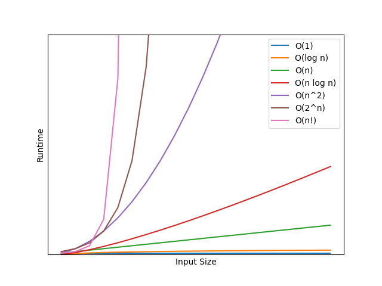

# Enterprise GIS

Doing GIS at enterprise scale is different from GIS workflows performed locally. Prof. Eric Shook at the University of Minnesota invited me to talk with students in his Advanced Geocomputing class about some of these differences. This post captures the most important ideas from that discussion: scaling, team collaboration, security, services-oriented architecture, and the broad set of technical skills required for enterprise GIS.

:simple-arcgis:
:fontawesome-solid-graduation-cap:

<!-- more -->

Enterprise GIS means working with more datasets, larger datasets, more users, greater diversity of user needs, and more complex systems to manage data and users. You need a different set of tools to deal with the different challenges that working at enterprise scale presents.

## Some solutions stop working

You have probably had an experience where you attempt to join two tables in ArcGIS Pro and you get a warning that at least one of the fields you are joining on is not indexed. If you're anything like me, you created the join without making other changes, and everything probably went fine. So why the warning? With relatively small datasets, it doesn't matter that the field isn't indexed. With large datasets, however, the performance benefits of indexing can be massive. 

Computer scientists have a notation called "Big O" to describe how processes get slower as the input size increases.

- O(1) processes always take the same amount of time, no matter how big the input is. Accessing a value in a Python dictionary by key is O(1).
- O(log n) processes scale with the log of the input size. Querying a sorted table is O(log n).
- O(n) processes scale linearly with the size of the input. Joining tables on indexed fields is O(n).
- O(n log n) processes scale with the input size multiplied by the log of the input size. Joining tables on non-indexed fields is O(n log n)
- O(n2) processes scale quadratically. Nested loops are O(n2).
- O(2n) processes scale exponentially. Exact solutions for optimal gerrymandering are O(2n).
- O(n!) processes scale factorially. Exact solutions to network routing problems are O(n!).

Ned Batchelder's [PyCon 2018 talk](https://www.youtube.com/watch?v=duvZ-2UK0fc) gives a good explanation of Big O if you want to know more. The important idea is that past a certain point, these processes are qualitatively, not just quantitatively, different from each other. Consequently, solutions at enterprise scale often need to be qualitatively different from solutions that work well with smaller inputs. 

## People don't scale

In order to work effectively at enterprise scale, you need to build strong relationships with the other people in your organization. But that can be difficult because of the way relationships scale. Two people have one relationship. Three people have four relationships - each bilateral relationship and the group dynamic of all three people. Four people have 11 relationships. It turns out that relationships scale O(2n), i.e. badly.

All human systems must deal with the poor scaling of relationships. This is why hierarchy, bureaucracy, and siloing exist - to reduce the number of relationships that are required for an organization to operate. At some point in your career, you will probably think "if I could just get 10 minutes with the director/CEO/governor, we could get this problem solved." In small organizations, that's possible. In large organizations, it's a fantasy that you have to let go of. 

## Agreement is the bottleneck

When you are working alone or in a small group, the main barrier to success is implementation. It's hard to make the thing you're trying to make. At enterprise scale, the bigger barrier is getting people to agree on what you should be trying to make. There are easily two hours of talking about what you should do for every one hour of doing it. The only thing worse than all that talking is not doing the talking. Because then you find out what you have is not what you need, and you need to have the discussion anyway.

Commitment to a shared goal is hard because people disagree. That means you need a method of productive disagreement. If somebody proposes something that seems like a bad idea, you need to be able to raise a concern or else you risk shipping poor quality output. If the group keeps arguing in circles without arriving at an agreement, you don't ship anything. 

One common mode of unproductive disagreement is arguing over things that aren't important. This is commonly called "bike-shedding", because it's the equivalent of arguing about the color of a bike shed at a nuclear power plant instead of arguing over the reactor design. Recognize and interrupt bike-shedding when you see it, and help bring the conversation back to topics that actually matter.

Unfortunately, there aren't many strong rules for what a system of productive disagreement might look like. The best option depends heavily on the culture of the organization and the nature of the relationships you have with the people you're disagreeing with. It will probably take several iterations to arrive at something that works. And if the group changes, like a new hire comes on board, you will likely have to tweak whatever system you have. Regardless of what you eventually create, you should think explicitly about how to work through disagreements.

## Security matters more

A common disagreement at enterprise scale is about security trade-offs. The most secure system is one that's disconnected from the internet, turned off, and encased in concrete behind armed guards. The most useable system is one where you have root access to everything without needing to authenticate. These are both horrible situations, which is why security is always about trade-offs. At enterprise scale, the balance tips more in favor of security and less in favor of usability.

Enterprise scale GIS has more users, which increases the probability some of them are malicious. And sufficiently advanced incompetence is indistinguishable from malice. The large pool of users, and especially their data, are a valuable resource. That makes the system an attractive target for attackers and creates a huge downside risk if the organization loses access to it. In addition, the greater complexity of the systems required for enterprise scale GIS creates a larger attack surface. There are more ways for attackers to infiltrate the system. 

These challenges mean that IT is going to ask you do things in the name of security that make your job harder. Feel free to grumble under your breath about that, but you still need to do it. 

## Data should be shared as services

The security challenge of sharing data is particularly important in an enterprise GIS context. The entire point of the system is to make GIS resources available to a large number of users. You can't make copies because now you need to keep track of all those copies, and deal with the nightmare of reconciling edits made against several different copies of a dataset. You can't give everybody access to a single authoritative database either, because that massively increases the risk of a data breach.

Instead, you should make enterprise GIS data available as web services. A single database exposed by a service prevents the need to copy data. Because the service can exercise control over how the underlying data can be accessed, you reduce the probability of a data breach. Web services are also typically accessed from a URL, which means anybody with a browser can use them. You don't need a powerful workstation with sophisticated desktop GIS software, because you can interact with a service from something as simple as a phone. 

In order to expose GIS resources as services, you are going to need some kind of software solution. Popular open source options are MapServer and GeoServer. In the Esri ecosystem, working with services means ArcGIS Enterprise and ArcGIS Online.

## You need a broader set of technical skills

Effectively deploying and maintaining those software solutions is going to require technical skills that aren't often considered "GIS" skills. For example, you need to have a decent understanding of the IT domain:

- Networking concepts like IP addresses, ports, proxies, and routing
- Security concepts like firewalls, TLS certificates, and authentication models
- Hardware details like the differences between CPU, RAM, and disk
- Architectural patterns like high-availability and workload separation
- Considerations for cloud vs on-premises computing

You will also need to know how you can mitigate the fact that a services-oriented architecture will generally be much slower than working with local data. You will need to make database queries faster by reducing the amount of data to be queried and indexing commonly-queried fields. You need to know how to implement various caching strategies to serve up data without having to query the database at all.

Lastly, you will need to script automation solutions to reduce the amount of manual work you need to do. As you are growing your code-writing skills, it's important to keep in mind that in enterprise GIS you are much more likely to need a script to move 10,000 files from one place to another than you are to need a script to build a convolutional neural network. In terms of useful languages, Python is a great choice because it is well integrated with many different types of systems. But you will probably also need to learn at least some PowerShell if you're working in Windows and Bash if you're working in Linux. The command line is a very powerful tool if you can become comfortable using it. 